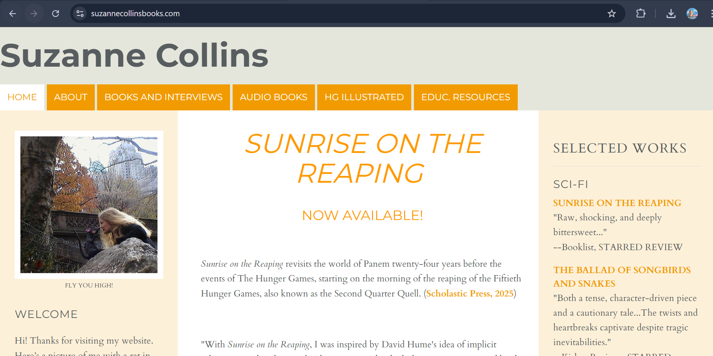
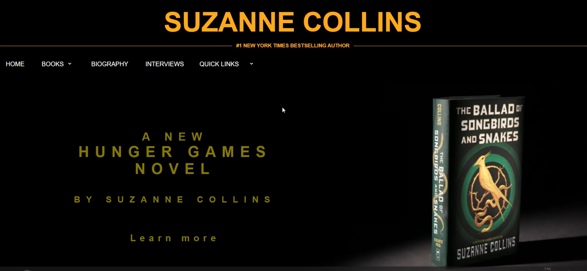
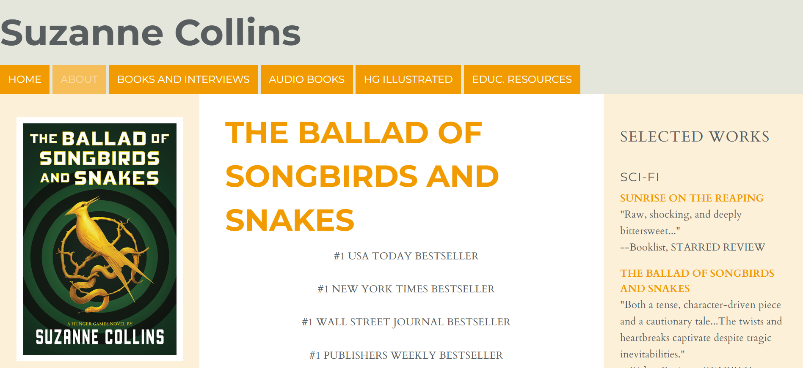
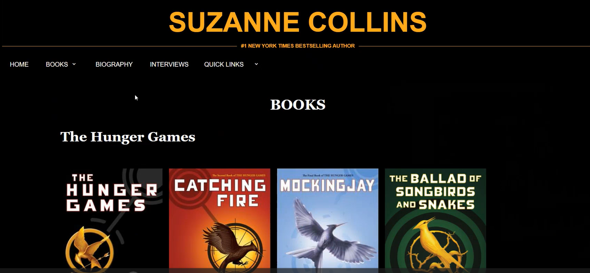
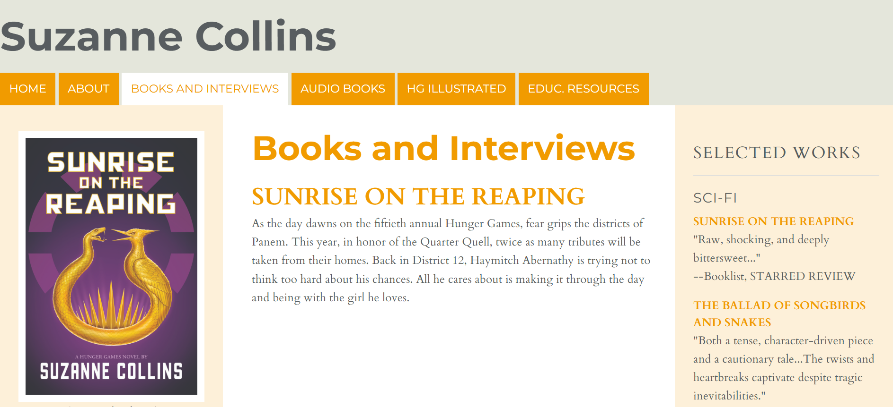
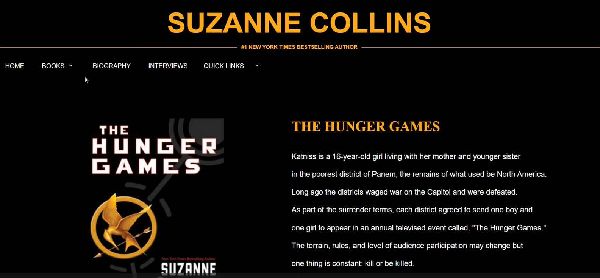
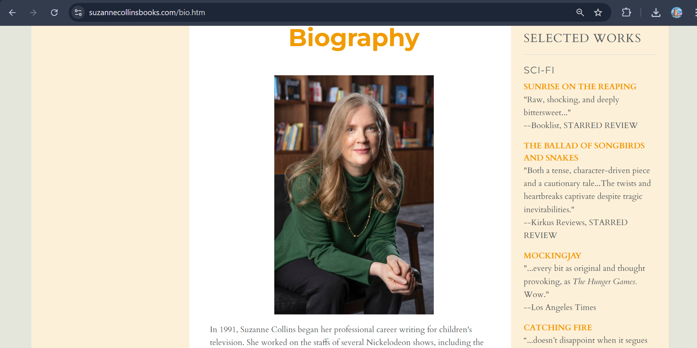
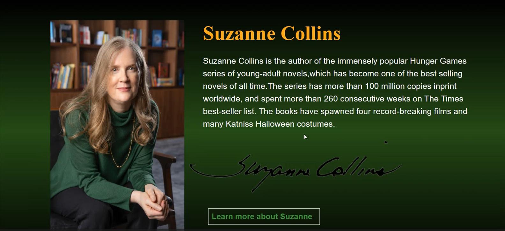

# *Suzanne Collins Book Website Redesign*  
A project to modernize and improve the user experience (UX) and visual design of the official Suzanne Collins book website. The focus was on improving navigation, readability, and mobile responsiveness, especially for the Hunger Games and Underland Chronicles series pages.

## Key Redesign Goals
- Enhanced Readability: Implement a cleaner layout and improved typography for a better reading experience.
- Mobile-First Design: Ensure the site is fully functional and aesthetically pleasing on all devices.
- Clearer Navigation: Simplify the menu structure to help users quickly find information about specific books or series.
- Modern Aesthetic: Update the overall visual style to be more engaging and contemporary.

## Before & After: Visual Comparison
To demonstrate the impact of the redesign, here are four screenshots showing the "Before" (Original Design) and "After" (New Design) states for the main homepage and the book series listing page.

<table width="100%">
  <tr>
    <td width="50%" align="center">
      
       
      <strong>Before: Homepage</strong>
    </td>
    <td width="50%" align="center">
      
       
      <strong>After: Homepage</strong>
    </td>
  </tr>
  <tr>
    <td width="50%" align="center">
      
       
      <strong>Before: The Hunger Games Series Page</strong>
    </td>
    <td width="50%" align="center">
      
       
      <strong>After: The Hunger Games Series Page</strong>
    </td>
  </tr>
  
   <tr>
    <td width="50%" align="center">
      
       
      <strong>Before: The Hunger Games Series Page</strong>
    </td>
    <td width="50%" align="center">
      
       
      <strong>After: The Hunger Games Series Page</strong>
    </td>
  </tr>
 <tr>
    <td width="50%" align="center">
      
       
      <strong>Before: The Hunger Games Series Page</strong>
    </td>
    <td width="50%" align="center">
      
       
      <strong>After: The Hunger Games Series Page</strong>
    </td>
  </tr>
</table>

## Technology Stack
Frontend: HTML  
Styling: CSS Modules
